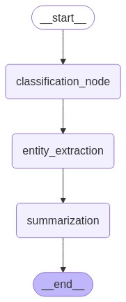

# AgenticClassification
Demonstrates the power of LangGraph by building a multi-step text analysis pipeline.


## Overview
Our use case will focus on processing a given text through three key stages:

1. **Text Classification**: We'll categorize the input text into predefined categories (e.g., News, Blog, Research, or Other).
2. **Entity Extraction**: We'll identify and extract key entities such as persons, organizations, and locations from the text.
3. **Text Summarization**: Finally, we'll generate a concise summary of the input text.



## Features
- **State Management**: Maintains processing context using a `State` class
- **Modular Nodes**: Independent nodes for classification, entity extraction, and summarization
- **LLM Integration**: Utilizes Ollama's LLM (llama3.2:1b) for NLP tasks
- **Visualization**: Auto-generates workflow diagrams using Mermaid
- **Test Pipeline**: Includes sample text processing demonstration

## Installation
1. **Requirements**:
   - Python 3.10+
   - [Ollama](https://ollama.ai/) installed locally
   - llama3.2:1b model downloaded (`ollama pull llama3.2:1b`)

## Usage
1. **Start Ollama server**:
```bash
ollama serve
```

2. **Run Jupyter notebook**:
```bash
jupyter notebook AgenticClassification.ipynb
```

## Project Structure
```bash
AgenticClassification.ipynb
├── Imports
├── State Class Definition
├── Node Implementations
│   ├── Classification
│   ├── Entity Extraction
│   └── Summarization
├── Workflow Construction
├── Visualization
└── Test Pipeline
```

### Processing Nodes
1. **Classification**:
   - Uses prompt template for category prediction
   - Categories: News, Blog, Research, Other

2. **Entity Extraction**:
   - Identifies named entities (Person, Organization, Location)
   - Returns comma-separated list

3. **Summarization**:
   - Generates concise one-sentence summary
   - Maintains key information from source text

**Note**: Ensure Ollama server is running and the specified model is downloaded before executing the notebook. Temperature parameter is set to 0 for deterministic outputs.
